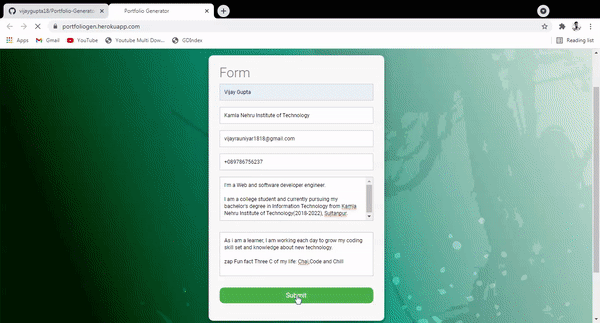

# Portfolio-Generator

A web app to auto Build a portfolio

### Tech Stack

- Nodejs

- CSS

- Javascript

- Ejs

- Express JS


[Visit Here](https://portfoliogen.herokuapp.com/)

- Enter the complete details of your portfolio you want.

- After Submitting you will get your desired portfolio.

- Click on view Page Source

- Copy the code and save it as .html file

- Do chnages as per requirements and its ready to Host Anywhere

🙂


😄
```diff
Adding more Features to portfolio soon.Stay Tuned!!


@@ Feel free  to contact us for PRs and Improvements in this project. @@ 
